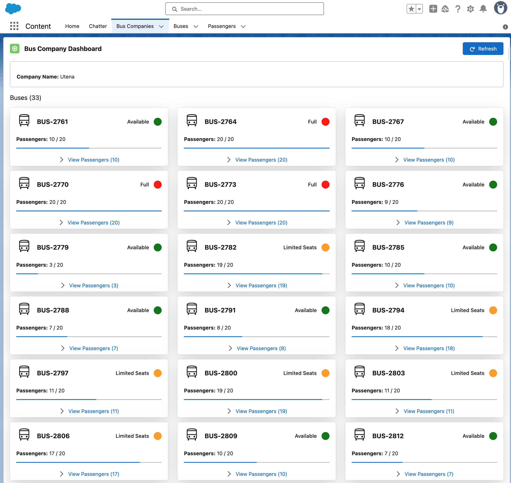

# Paystrax
Paystrax

# Data cleanup

```
System.debug('=== STARTING DATA CLEANUP ===');
DataCleanupUtility.safeCleanAllData('DELETE_ALL_TEST_DATA');
System.debug('=== CLEANUP COMPLETE ===');
```

# Creating Test Data

```
// COMPACT TEST DATA CREATION - Respects 20-passenger limit
System.debug('=== CREATING TEST DATA ===');

// Create Bus Companies
List<Bus_Company__c> companies = new List<Bus_Company__c>{
    new Bus_Company__c(Name = 'Vilnius', Company_Code__c = 'VLN001'),
    new Bus_Company__c(Name = 'Kaunas', Company_Code__c = 'KNS002'),
    new Bus_Company__c(Name = 'Utena', Company_Code__c = 'UTE003')
};
insert companies;
System.debug('✅ Created ' + companies.size() + ' companies');

// Create 100 Buses
List<Bus__c> buses = new List<Bus__c>();
for (Integer i = 0; i < 100; i++) {
    buses.add(new Bus__c(Bus_Company__c = companies[Math.mod(i, 3)].Id));
}
insert buses;
System.debug('✅ Created ' + buses.size() + ' buses');

// Create Passengers - Test scenarios with max 20 per bus
List<Passenger__c> passengers = new List<Passenger__c>();

// Specific test cases: 0,5,10,15,19,20 passengers
Integer[] testCounts = new Integer[]{0,5,10,15,19,20,0,5,10,15,19,20};
for (Integer i = 0; i < testCounts.size() && i < buses.size(); i++) {
    for (Integer j = 0; j < testCounts[i]; j++) {
        passengers.add(new Passenger__c(
            Name = 'Test-' + i + '-' + j,
            Bus__c = buses[i].Id
        ));
    }
}

// Random passengers for remaining buses (0-20 each)
for (Integer i = testCounts.size(); i < buses.size(); i++) {
    Integer count = Math.mod(Math.abs(Crypto.getRandomInteger()), 21);
    for (Integer j = 0; j < count; j++) {
        passengers.add(new Passenger__c(
            Name = 'Pass-' + i + '-' + j,
            Bus__c = buses[i].Id
        ));
    }
}

// Insert in batches
Integer batchSize = 2000;
Integer totalInserted = 0;
for (Integer i = 0; i < passengers.size(); i += batchSize) {
    List<Passenger__c> batch = new List<Passenger__c>();
    for (Integer j = i; j < Math.min(i + batchSize, passengers.size()); j++) {
        batch.add(passengers[j]);
    }
    try {
        insert batch;
        totalInserted += batch.size();
    } catch (Exception e) {
        System.debug('Batch failed: ' + e.getMessage());
    }
}

System.debug('✅ Created ' + totalInserted + ' passengers');

// Verify no buses exceed 20 passengers
List<AggregateResult> violations = [
    SELECT Bus__c, COUNT(Id) cnt
    FROM Passenger__c 
    GROUP BY Bus__c 
    HAVING COUNT(Id) > 20
];

if (violations.size() > 0) {
    System.debug('❌ Found ' + violations.size() + ' buses with >20 passengers');
} else {
    System.debug('✅ All buses have ≤20 passengers');
}

System.debug('=== SUMMARY ===');
System.debug('Companies: ' + [SELECT COUNT() FROM Bus_Company__c]);
System.debug('Buses: ' + [SELECT COUNT() FROM Bus__c]);
System.debug('Passengers: ' + [SELECT COUNT() FROM Passenger__c]);
System.debug('🚀 Test data ready!');
```

# Expected result

